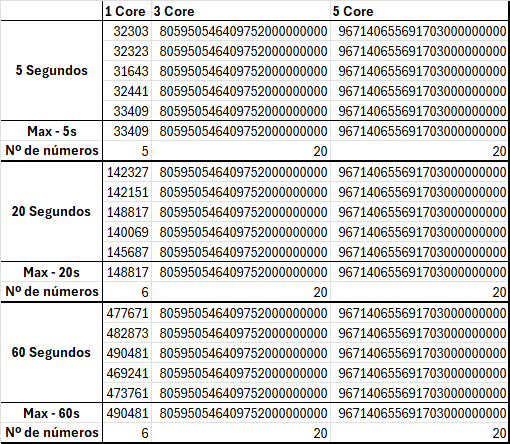

# CPD_TP1

## Resultados Obtidos

---

## Funcionamento

__O programa executa a função find_prime(timeout, num_processes).__

---

Na função __find_prime(timeout, num_processes)__, são realizadas as seguintes etapas:

- É criado um Manager para gerir a informação partilhada entre processos. É também criado um dicionário "dict()", para
  que permite que as alterações sejam refletidas em todos os processos.
- O menor valor primo existente (2) é iniciado no dicionário.
- Um objeto de bloqueio é criado para controlar e sincronizar o acesso ao dicionário.
- É definida uma variável __range_per_process__, que determina o intervalo máximo de trabalho para cada processo.

Para cada processo passado como parâmetro:

- Calcula-se um número inicial ímpar, uma vez que o único número par é o 2.
- O número máximo do processo é calculado com base no valor de __range_per_process__.
- Inicia-se um processo que executará a função __prime_search()__ com os parâmetros definidos anteriormente: número
  inicial,
  número máximo do processo, dicionário partilhado e limite de tempo.
- Cada processo criado é adicionado a uma lista de processos.
- Os processos são então iniciados.

__Esta função aguarda o término de todos os processos e retorna o maior valor encontrado.__

---
Na função __prime_search(start, end, shared_dict, timeout):__

- Valida-se se o número inicial é par e, se for, é convertido para ímpar.

Enquanto o número atual for menor que o teto máximo do processo e o tempo estiver dentro do limite:

- É invocado o método miller_rabin(número atual) para verificar se o número é primo.
- Se o número for primo e maior do que o valor atual armazenado no dicionário, este é substituído.
- O número atual é incrementado por dois para passar ao próximo número ímpar.

---
Na função __prime_search(start, end, shared_dict, timeout):__

- Verifica-se se o número atual é 2 ou 3, retornando verdadeiro se forem, ou falso se forem menores do que ambos ou se
  forem pares.
- São inicializadas as variáveis "s" e "d". "s" é inicializada a 0 e "d" é inicializada como o número atual menos 1.
- Enquanto "d" não for par, "d" é dividido por 2 e s é incrementado por 1. Este processo descompõe o número atual - 1 em
  2^s * d, onde d é um número par.

O ciclo for realiza k testes:

- A variável "a" recebe um valor aleatório entre 2 e n - 2 (inclusive).
- A variável "x" recebe um valor calculado com a^(d % n), onde d é derivado da decomposição de (n-1) em 2^(s * d).
- Se "x" for igual a 1 ou "n" - 1, o ciclo continua. Caso contrário, entra num outro ciclo para efetuar verificações
  adicionais.
- Este ciclo repete-se "s" - 1 vezes, onde "s" representa o número de vezes que "d" foi reduzido pela metade até se
  tornar ímpar.
    - "x" é elevado ao quadrado e reduzido módulo "n".
    - Se "x" se tornar n - 1, o ciclo é interrompido.
- Se nenhuma das operações anteriores resultar em "n" - 1, então "n" não é primo e é devolvido falso.